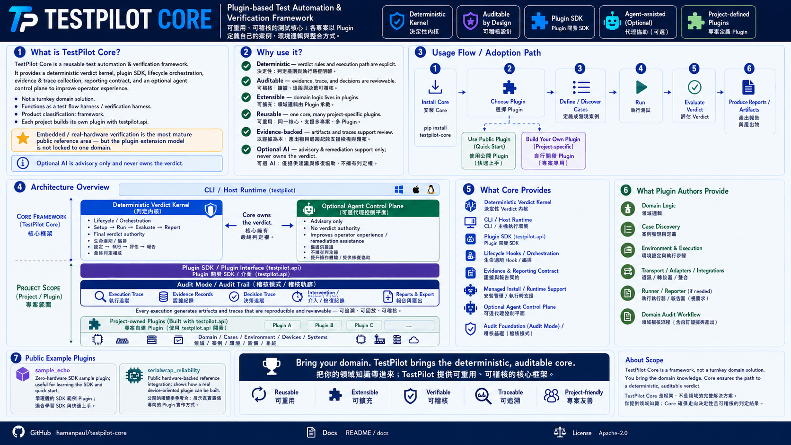

> **Scope:** `testpilot-core` is the host framework for plugin-based test verification. On the core-owned execution path it orchestrates the test lifecycle, records evidence and traces, and preserves the canonical verdict produced through plugin evaluation. Plugins define project-specific cases, environment operations, and evaluation semantics. Agent intervention is optional and is never, by itself, proof that a verification gate passed.

# TestPilot

> **[English](#english)** ｜ **[繁體中文](#繁體中文)**

---



## Install

This README is the canonical install reference. For the maintainer-oriented managed install, see [Quick Start](#quick-start) and [Managed Install and Update](#managed-install-and-update). For plugin development, registry mode and path mode are both supported; path mode can run a plugin project directly without installing that plugin first.

After a managed install or update, run `testpilot --verify-install` to confirm health.

## Usage

`testpilot` is the host runtime. Test capabilities are supplied by plugins developed for each project.

Use `testpilot list-plugins` to see installed plugins and `testpilot run <plugin>` to drive the generic core run path when the plugin does not expose its own command.

A plugin can be selected two ways:

| Form | Resolution | Use when |
| --- | --- | --- |
| `testpilot <PLUGIN_NAME> [ARGS]...` | registry mode — `testpilot.plugins` entry points of the installed environment | the plugin is installed |
| `testpilot <PLUGIN_PATH> [ARGS]...` | path mode — a plugin project directory on disk | running a checkout that is not (or not yet) installed |

```bash
testpilot <plugin> --case D001            # registry mode
testpilot /path/to/my_plugin --case D001  # path mode, same plugin command
testpilot ../my_plugin                    # relative paths work too
```

Both forms dispatch to the same plugin-owned command, so plugin-specific options behave identically. Path mode details:

- `PLUGIN_PATH` is the **project root** — the directory containing `pyproject.toml` with a `[project.entry-points."testpilot.plugins"]` table. That table is the single source of truth for the plugin's name and import target, so both modes agree on identity.
- The project must declare exactly one plugin. More than one is refused rather than guessed; install the project and select by name instead.
- The project copy wins over an installed distribution of the same name, even when that distribution is already imported. If the declared module still resolves outside the requested project, the run is refused rather than silently testing the wrong tree.
- Path mode does not skip the SDK API-version gate — an incompatible plugin is rejected exactly as in registry mode.
- A registered plugin name always takes precedence over a same-named directory in the working directory, so path mode cannot shadow an installed plugin by accident.
- A token is read as a path when it contains a separator, starts with `.` or `~`, or names an existing directory. Anything else is treated as a plugin name or subcommand.

## Version

The canonical project version is `VERSION`; release tags use `vX.Y.Z`.
`testpilot --version` also inventories every installed `testpilot.plugins` entry point so operators can see the effective core/plugin/API combination:

```text
TestPilot <core-version> (<source-ref>)
  plugin <name> <plugin-version> (api <api-version>)
```

---

## English

**TestPilot Core is a plugin-based test automation and verification framework.**

It provides a versioned plugin SDK (`testpilot.api`), CLI host, lifecycle orchestration, evidence/trace capture, reporting contracts, transport/run-backend abstractions, and an optional agent-assisted control plane. Project-specific test logic belongs in independently developed plugins.

### Scope and current fit

The core extension model is not tied to a single product domain, but the project has an embedded and real-hardware testing heritage. Current field usage, bundled transport support, managed-install assumptions, and most non-trivial examples are still concentrated around device verification.

That means two things at the same time:

- TestPilot Core should not be described as an embedded-only framework; a project can provide its own plugin, cases, environment logic, runner, reporter, and integrations through the public SDK.
- TestPilot Core also does **not** claim ready-made support for arbitrary domains. Outside the currently exercised device/real-hardware workflows, adopters are expected to supply and validate their own plugin integration.

The core wheel does not ship a domain test suite. Public references currently include:

- `examples/sample_echo/` — a zero-hardware, runnable SDK example that demonstrates packaging, discovery, execution, verdict production, and a plugin-owned CLI.
- [`serialwrap_reliability`](https://github.com/hamanpaul/serialwrap/tree/main/reliability) — a hardware-backed TestPilot integration used to exercise serialwrap reliability workflows. It lives in the public `serialwrap` repository and is maintained separately from the core.

### Architecture

The default core-owned execution path is split into two concerns:

- **Deterministic verdict kernel** — lifecycle execution, evidence collection, retry/timeout handling, canonical trace/result production, and report handoff. The domain-specific pass/fail semantics still come from the plugin's `evaluate()` implementation.
- **Copilot SDK control plane** — per-case session foundation, lifecycle hooks, advisory planning, tiered environment recovery, and extension surfaces such as custom agents / skills / selective MCP.

Core principle: **agent assistance does not own the final verdict.**

Current landed control-plane subset:

- per-case runner selection with `selection_trace`
- best-effort per-case Copilot session foundation
- lifecycle hook dispatch (`pre_case`, `post_case`, `pre_step`, `post_step`, `on_failure`, `on_retry`)
- advisory collection plus tier-1 deterministic remediation and opt-in tier-2 one-shot planning between retry attempts

Tier-2 is reached only after the configured consecutive tier-1 failures. Core builds a bounded, tool-denied one-shot prompt from the plugin's advertised environment capabilities; the plugin executes the validated plan, then core forces deterministic `verify_env`. The agent does not receive authority to rewrite case semantics or the canonical verdict. Every intervention is marked `agent_recovered` and retained in bounded/redacted case and run audit artifacts; the marker means the agent intervened, not that the verification gate passed.

See [Tier-2 Environment Recovery Design](docs/superpowers/specs/2026-07-17-tier2-env-recovery-design.md).

Custom agents / skills / MCP remain extension surfaces in the current codebase rather than default hot-path runtime wiring.

> Plugins may also provide a custom runner. That is an intentional extension path; custom runners own more of their execution pipeline and do not automatically receive every core-owned analysis path. The framework therefore distinguishes the default **core-owned execution path** from plugin-owned custom execution.

### Prerequisites

Core / SDK development:

- **Python 3.11+**
- **git**
- **[uv](https://docs.astral.sh/uv/)** — preferred package manager for this repository

Workflow-specific dependencies are plugin-owned. In particular, [`serialwrap`](https://github.com/hamanpaul/serialwrap) is required by the existing UART/device workflows and is pinned by the current managed-install profile, but it is not a conceptual requirement for every possible TestPilot plugin. The `sample_echo` reference runs without hardware.

Developer checkouts that use serialwrap and manage it manually can set the binary path with an environment variable:

```bash
export SERIALWRAP_BIN=/path/to/serialwrap
```

or in `configs/testbed.yaml`:

```yaml
testbed:
  serialwrap_binary: /path/to/serialwrap
```

> Current serialwrap resolution order: `SERIALWRAP_BIN` env var → `testbed.yaml` config → error exit when a serialwrap-backed workflow requires it.

### Quick Start

The repository's managed installer is designed around the maintainer's current QC/TEST deployment profile. It resolves the core plus the plugin repositories declared in `install-manifest.yaml`, and therefore may require credentials for non-public plugin repositories present in that manifest.

```bash
TESTPILOT_INSTALL_TOKEN=<fine-grained read-only PAT> bash scripts/install.sh
testpilot --verify-install
testpilot list-plugins
```

Install only a selected manifest plugin with `--plugins`:

```bash
TESTPILOT_INSTALL_TOKEN=<PAT> bash scripts/install.sh --plugins <plugin_name>
```

For external plugin development, it is usually simpler to install TestPilot Core in a development environment and either install the plugin package normally or run the plugin checkout with path mode:

```bash
testpilot /path/to/my_plugin --help
testpilot /path/to/my_plugin
```

Once installed, list and run registry plugins:

```bash
testpilot list-plugins
testpilot list-cases <plugin>
testpilot run <plugin>
```

> When a plugin context is resolved through the generic core path, the CLI stages that plugin's `testbed.yaml.example` into `configs/testbed.yaml`. The current implementation overwrites the effective file when switching plugin contexts; treat the plugin template as the source used for staging and keep project-specific configuration under version control in the plugin project rather than assuming the staged file is persistent.

### Managed Install and Update

The supported QC/TEST install uses a managed venv. Online install resolves the **newest API-compatible** `core` and declared plugin releases; `serialwrap` stays pinned in `install-manifest.yaml`. An offline bundle is an exact, SHA256-verified snapshot. Pin a component explicitly with `--plugins <name>@<version>` or with a manifest version when needed.

```bash
~/.local/share/testpilot/.venv   # managed runtime virtualenv
~/.local/bin/testpilot           # wrapper, no activation required
~/.agents/skills/testpilot-normal-test
```

**Online install:**

```bash
TESTPILOT_INSTALL_TOKEN=<fine-grained read-only PAT> bash scripts/install.sh
```

**Offline install:** build a bundle on a networked Linux machine with `scripts/build-bundle.sh`, then transfer and install it on the target machine.

```bash
# Build on a networked machine:
bash scripts/build-bundle.sh
# Install on the offline machine (verifies SHA256SUMS, installs with --no-index):
bash scripts/install.sh --offline testpilot-bundle-<ver>-linux-<arch>-cp<XY>.tar.gz
```

**Update and verify:**

```bash
testpilot --update            # reinstall/reconcile the current manifest-managed set
testpilot --verify-install    # report managed install health
```

`--update` snapshots the environment first. If the post-update verification fails, rollback uses only the local wheel cache under `${TESTPILOT_HOME:-~/.local/share/testpilot}/.wheel-cache`; it does not fall back to a public package index. If the cached wheels are insufficient, rollback fails loudly and asks for reinstall from a known-good offline bundle.

### CLI Entry Points

Use the installed `testpilot` command for normal operation. Developer checkouts can still use `python -m testpilot.cli` when debugging the repository.

Plugin-owned CLI commands are registered from installed plugin packages when `testpilot.cli` is imported. `--root <path>` selects the runtime project root for cases/configs/reports; it does not dynamically replace the registered plugin CLI surface with commands from `<path>/plugins`.

The core host commands are:

```bash
testpilot --version
testpilot list-plugins
testpilot list-cases <plugin>
testpilot run <plugin>
```

<!-- testpilot-help:start -->
<!-- BEGIN: cli-help marker="testpilot-help" -->
Usage: testpilot [OPTIONS] COMMAND [ARGS]...

  TestPilot — plugin-based test automation and verification framework.

  A plugin can be selected two ways:
    testpilot <PLUGIN_NAME> [ARGS]...  registry mode — an installed plugin,
                                       resolved via testpilot.plugins entry
                                       points
    testpilot <PLUGIN_PATH> [ARGS]...  path mode — a plugin project directory
                                       (the one holding pyproject.toml with a
                                       testpilot.plugins entry point); runs
                                       without installing it, e.g.
                                       testpilot /path/to/plugin

  Both forms dispatch to the same plugin-owned command, so plugin options
  apply identically. PLUGIN_PATH may be absolute or relative; a registered
  plugin name always takes precedence over a same-named directory.

Options:
  --version         Show version and exit.
  -v, --verbose     Enable debug logging.
  --root DIRECTORY  Project root directory.
  --update REF      Reinstall and reconcile the managed wheel install from its
                    pinned manifest, then exit. REF is accepted but cross-
                    version update is not yet implemented; the currently-
                    pinned set is reinstalled.
  --verify-install  Report managed install health and exit.
  --help            Show this message and exit.

Commands:
  install-doctor  Check manifest plugin API-compat against installed core...
  list-cases      List test cases for a plugin.
  list-plugins    List available test plugins.
  run             Run tests for a plugin.
<!-- END: cli-help marker="testpilot-help" -->
<!-- testpilot-help:end -->

<!-- testpilot-update-help:start -->
<!-- BEGIN: cli-help marker="testpilot-update-help" -->
Usage: testpilot [OPTIONS] COMMAND [ARGS]...

  TestPilot — plugin-based test automation and verification framework.

  A plugin can be selected two ways:
    testpilot <PLUGIN_NAME> [ARGS]...  registry mode — an installed plugin,
                                       resolved via testpilot.plugins entry
                                       points
    testpilot <PLUGIN_PATH> [ARGS]...  path mode — a plugin project directory
                                       (the one holding pyproject.toml with a
                                       testpilot.plugins entry point); runs
                                       without installing it, e.g.
                                       testpilot /path/to/plugin

  Both forms dispatch to the same plugin-owned command, so plugin options
  apply identically. PLUGIN_PATH may be absolute or relative; a registered
  plugin name always takes precedence over a same-named directory.

Options:
  --version         Show version and exit.
  -v, --verbose     Enable debug logging.
  --root DIRECTORY  Project root directory.
  --update REF      Reinstall and reconcile the managed wheel install from its
                    pinned manifest, then exit. REF is accepted but cross-
                    version update is not yet implemented; the currently-
                    pinned set is reinstalled.
  --verify-install  Report managed install health and exit.
  --help            Show this message and exit.

Commands:
  install-doctor  Check manifest plugin API-compat against installed core...
  list-cases      List test cases for a plugin.
  list-plugins    List available test plugins.
  run             Run tests for a plugin.
<!-- END: cli-help marker="testpilot-update-help" -->
<!-- testpilot-update-help:end -->

Repository skills for agent-assisted workflows live under `skills/`.

### Azure OpenAI (BYOK)

TestPilot Core automatically uses Azure when all required values are present. Without an API key it runs in deterministic/no-agent mode; a key without an endpoint or deployment produces a non-blocking misconfiguration notice. If `COPILOT_PROVIDER_TYPE` is set to a non-`azure` value, core also treats the runtime as misconfigured and emits the same redacted notice.

```bash
export COPILOT_PROVIDER_BASE_URL=https://your-resource.openai.azure.com
export COPILOT_PROVIDER_API_KEY='<set in shell profile or secret store>'
export COPILOT_MODEL=your-deployment-name
export COPILOT_PROVIDER_AZURE_API_VERSION=2024-10-21
testpilot run <plugin_name>
```

`COPILOT_PROVIDER_TYPE` is not an enable switch; core constructs only the Azure provider and rejects non-azure values as misconfiguration. Azure deployment selection is independent of plugin runner labels. Per-case planning is advisory, tier-2 recovery requires plugin opt-in, and deterministic remediation remains plugin-owned. Core-owned usage and observational benefit metrics are written under `artifact_dir/agent_usage`; shared run-analysis tokens are not allocated to cases. Custom/skeleton runners report `unsupported_execution_path` and make no core model calls.

### Writing a Plugin

Copy the SDK scaffold and register it from your plugin package:

```bash
cp -r plugins/_template plugins/my_plugin
```

```toml
[project.entry-points."testpilot.plugins"]
my_plugin = "plugins.my_plugin.plugin:Plugin"
```

```bash
uv pip install -e .
testpilot list-plugins
```

Implement the `PluginBase` contract: declare `api_version`, `name`, `discover_cases()`, `execute_step()`, and `evaluate()`; override optional hooks such as `setup_env()`, `verify_env()`, `teardown()`, `create_reporter()`, `create_runner()`, `register_cli()`, and remediation hooks as needed.

Plugins import the public SDK surface from `testpilot.api`; they must not reach into `testpilot.core`, `testpilot.schema`, `testpilot.reporting`, `testpilot.transport`, or `testpilot.runtime` internals. See `plugins/_template/README.md` and `docs/plugin-dev-guide.md` for the current contract.

For a complete runnable zero-hardware reference, see `examples/sample_echo/`.

### Project Structure

```text
src/testpilot/
  api/        # public plugin SDK surface (testpilot.api)
  core/       # orchestrator, plugin_base, plugin_loader, testbed_config
  reporting/  # reporter and report helpers
  transport/  # transport abstractions
  schema/     # YAML case schema validation
  runtime/    # run backend
plugins/
  _template/  # plugin SDK scaffold (not discoverable on its own)
examples/
  sample_echo/ # runnable public reference plugin
configs/      # effective runtime testbed.yaml for the selected core path
docs/         # current docs plus historical plans/specs
scripts/      # install/release/support utilities
skills/       # repository agent skills
tests/        # core test suite
```

### Versioning and Release

The canonical project version lives in `VERSION`; `pyproject.toml` uses that dynamic version and `src/testpilot/__init__.py` mirrors it. Release tags use Semantic Versioning `vX.Y.Z`.

User-facing pull requests should carry a changelog fragment or explicitly record why no changelog entry is needed. `testpilot --version` prints the core version followed by every installed plugin distribution version and declared SDK API version; a broken plugin metadata record is shown as `unknown` without hiding the remaining inventory.

---

## 繁體中文

**TestPilot Core 是一套 Plugin 化的測試自動化與驗證框架。**

Core 提供具版本的 Plugin SDK（`testpilot.api`）、CLI host、測試生命週期編排、evidence / trace 蒐集、reporting contract、transport / run-backend abstraction，以及選配的 Agent-assisted control plane。各專案真正要測什麼、如何操作環境、如何判讀 domain-specific 條件，則由各自的 Plugin 實作。

### 定位與目前適用範圍

TestPilot Core 的 Plugin extension model 沒有綁死單一產品領域，但這個專案的來源與目前主要實績仍是 embedded / real-hardware verification。現有 field usage、內建 transport、managed-install profile 與大部分複雜案例，也仍集中在設備測試。

因此目前比較準確的說法是：

- TestPilot Core **不是嵌入式專用**；專案可以透過公開 SDK 自行提供 Plugin、cases、環境操作、runner、reporter 與整合方式。
- TestPilot Core 也**沒有宣稱任意 domain 開箱即用**。在目前已實際驗證的 device / real-hardware workflow 之外，採用者需要自行開發並驗證對應的 Plugin integration。

Core wheel 本身不包含 domain test suite。目前公開 reference 包含：

- `examples/sample_echo/`：不需要硬體的 runnable SDK example，用來示範 package、discovery、execution、verdict 與 plugin-owned CLI。
- [`serialwrap_reliability`](https://github.com/hamanpaul/serialwrap/tree/main/reliability)：位於公開 `serialwrap` repo 的實機 TestPilot integration，用於 serialwrap reliability workflow；它與 Core 分開維護。

### 架構

預設的 core-owned execution path 可以拆成兩個主要 concern：

- **Deterministic verdict kernel** — 執行 lifecycle、蒐集 evidence、管理 retry / timeout、產生 canonical trace/result 並交給 reporter；真正的 domain-specific Pass / Fail 語意仍由 Plugin 的 `evaluate()` 定義。
- **Copilot SDK control plane** — per-case session foundation、lifecycle hooks、advisory planning、分層 environment recovery，以及 custom agents / skills / selective MCP 等 extension surface。

核心原則：**Agent 可以協助，但不擁有最終 verdict。**

目前已落地的 control-plane 子集：

- per-case runner selection 與 `selection_trace`
- best-effort per-case Copilot session foundation
- lifecycle hooks：`pre_case` / `post_case` / `pre_step` / `post_step` / `on_failure` / `on_retry`
- advisory collection，以及 retry 間的 tier-1 deterministic remediation / opt-in tier-2 one-shot planning

tier-2 只有在設定的 tier-1 連續失敗門檻後才會進入。Core 依 Plugin 宣告的 environment capabilities 建立 bounded、tool-denied one-shot prompt；Plugin 執行經 schema / budget 驗證的 plan 後，Core 仍強制執行 deterministic `verify_env`。Agent 不具有改寫 case semantics 或 canonical verdict 的權限。`agent_recovered` 只表示 Agent 曾介入，不代表 verification gate 已經通過；介入紀錄會保存在有長度上限且經過去敏的 case / run audit artifacts。

> Plugin 也可以提供 custom runner。這是刻意保留的 extension path；custom runner 會自行承擔更多 execution pipeline 責任，也不會自動取得所有 core-owned analysis path。因此文件會區分預設的 **core-owned execution path** 與 plugin-owned custom execution。

### 前置需求

Core / SDK 開發：

- **Python 3.11+**
- **git**
- **[uv](https://docs.astral.sh/uv/)** — 本 repo 建議使用的 Python package manager

其他依賴由 Plugin / workflow 決定。特別是 [`serialwrap`](https://github.com/hamanpaul/serialwrap) 是目前 UART / device workflow 的必要元件，現行 managed-install profile 也會 pin 並安裝它；但它不是所有 TestPilot Plugin 的概念性必要條件。`sample_echo` 不需要硬體即可執行。

需要 serialwrap 的開發者 checkout，可用環境變數指定 binary：

```bash
export SERIALWRAP_BIN=/path/to/serialwrap
```

或在 `configs/testbed.yaml` 指定：

```yaml
testbed:
  serialwrap_binary: /path/to/serialwrap
```

### 快速開始

目前 repository 內的 managed installer 是依維護者現行 QC / TEST deployment profile 設計，會解析 `install-manifest.yaml` 中宣告的 Core 與 Plugin repositories；若 manifest 包含非公開 Plugin，便需要相應的 repository 權限。

```bash
TESTPILOT_INSTALL_TOKEN=<fine-grained read-only PAT> bash scripts/install.sh
testpilot --verify-install
testpilot list-plugins
```

只安裝 manifest 中指定的 Plugin：

```bash
TESTPILOT_INSTALL_TOKEN=<PAT> bash scripts/install.sh --plugins <plugin_name>
```

若是外部 Plugin 開發，通常可以直接準備 TestPilot Core 的開發環境，再選擇正常安裝 Plugin package，或直接用 path mode 跑尚未安裝的 Plugin checkout：

```bash
testpilot /path/to/my_plugin --help
testpilot /path/to/my_plugin
```

安裝後可使用：

```bash
testpilot list-plugins
testpilot list-cases <plugin>
testpilot run <plugin>
```

> 經 generic core path 解析 Plugin context 時，CLI 目前會把該 Plugin 的 `testbed.yaml.example` stage 到 `configs/testbed.yaml`；切換 Plugin 時會覆寫 effective file。不要把 staged file 當成永久設定來源，專案需要保存的環境設定應留在自己的 Plugin 專案中。

### Managed Install 與 Update

目前支援的 QC / TEST 安裝使用 managed venv。Online install 會解析**最新且 SDK API 相容**的 Core 與 manifest Plugin release；`serialwrap` 則仍由 `install-manifest.yaml` 明確 pin。Offline bundle 是一份 SHA256 驗證過的精確 snapshot。

```bash
~/.local/share/testpilot/.venv   # managed runtime virtualenv
~/.local/bin/testpilot           # wrapper，免 activate
~/.agents/skills/testpilot-normal-test
```

**線上安裝：**

```bash
TESTPILOT_INSTALL_TOKEN=<fine-grained read-only PAT> bash scripts/install.sh
```

**離線安裝：**

```bash
# 有網路的 Linux 主機：
bash scripts/build-bundle.sh

# 目標主機（驗證 SHA256SUMS、--no-index）：
bash scripts/install.sh --offline testpilot-bundle-<ver>-linux-<arch>-cp<XY>.tar.gz
```

**更新與驗證：**

```bash
testpilot --update
testpilot --verify-install
```

`--update` 會先快照目前環境。若 post-update verification 失敗，rollback 只使用 `${TESTPILOT_HOME:-~/.local/share/testpilot}/.wheel-cache` 的本地 wheel cache，不會退回 public package index；cache 不足時會明確失敗並要求用已知良好的 offline bundle 重裝。

### CLI 與 Plugin 選取

核心 host 指令：

```bash
testpilot --version
testpilot list-plugins
testpilot list-cases <plugin>
testpilot run <plugin>
```

Plugin 可用兩種形式選取：

| 形式 | 解析方式 | 使用時機 |
| --- | --- | --- |
| `testpilot <PLUGIN_NAME> [ARGS]...` | registry mode——目前環境已安裝的 `testpilot.plugins` entry point | Plugin 已安裝 |
| `testpilot <PLUGIN_PATH> [ARGS]...` | path mode——磁碟上的 Plugin project root | 要跑尚未安裝的 checkout |

```bash
testpilot <plugin> --case D001
testpilot /path/to/my_plugin --case D001
testpilot ../my_plugin
```

兩種形式都 dispatch 到同一個 Plugin-owned command。Path mode 仍使用專案自己的 `[project.entry-points."testpilot.plugins"]` 作為 identity authority，也不會繞過 SDK API compatibility gate；若同名 installed package 已載入，Core 會確認實際 import 的 code 仍位於指定 project 之下，否則拒絕執行。

### Azure OpenAI（BYOK）

當 Azure endpoint、API key 與 deployment 都存在時，TestPilot Core 自動啟用 Azure；沒有 key 時使用 deterministic/no-agent mode。部分設定缺漏或 `COPILOT_PROVIDER_TYPE` 為非 `azure` 值時，會回報去敏的 misconfigured notice，並繼續 deterministic execution。

```bash
export COPILOT_PROVIDER_BASE_URL=https://your-resource.openai.azure.com
export COPILOT_PROVIDER_API_KEY='<set in shell profile or secret store>'
export COPILOT_MODEL=your-deployment-name
export COPILOT_PROVIDER_AZURE_API_VERSION=2024-10-21
testpilot run <plugin_name>
```

Per-case planning 僅供 advisory；tier-2 需要 Plugin opt-in，deterministic remediation 仍由 Plugin 負責。Core-owned usage / observational metrics 會寫入 `artifact_dir/agent_usage`；custom / skeleton execution path 不呼叫 core model，並回報 `unsupported_execution_path`。

### 撰寫 Plugin

Plugin 從 `testpilot.api` 使用公開 SDK，而不是依賴 Core 私有模組：

```toml
[project.entry-points."testpilot.plugins"]
my_plugin = "my_plugin.plugin:Plugin"
```

必要 contract 包含 `api_version`、`name`、`discover_cases()`、`execute_step()`、`evaluate()`；依需求可覆寫 `setup_env()`、`verify_env()`、`teardown()`、`create_reporter()`、`create_runner()`、`register_cli()` 與 remediation hooks。

完整 contract 請見 `plugins/_template/README.md` 與 `docs/plugin-dev-guide.md`；零硬體 runnable example 請見 `examples/sample_echo/`。

### 版本與發布

Canonical project version 位於 `VERSION`；`pyproject.toml` 使用該 dynamic version，`src/testpilot/__init__.py` 維持鏡像。Release tag 採 Semantic Versioning `vX.Y.Z`。

對外可見的變更應帶 changelog fragment，或在 PR 中明確說明為何不需要。`testpilot --version` 會在 Core 版本後列出已安裝 Plugin 的 distribution version 與 SDK API version；單一 Plugin metadata 損壞時以 `unknown` 顯示，不阻斷其餘 inventory。