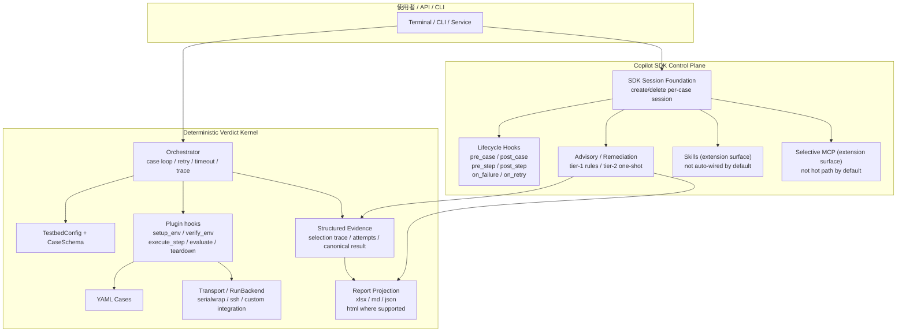
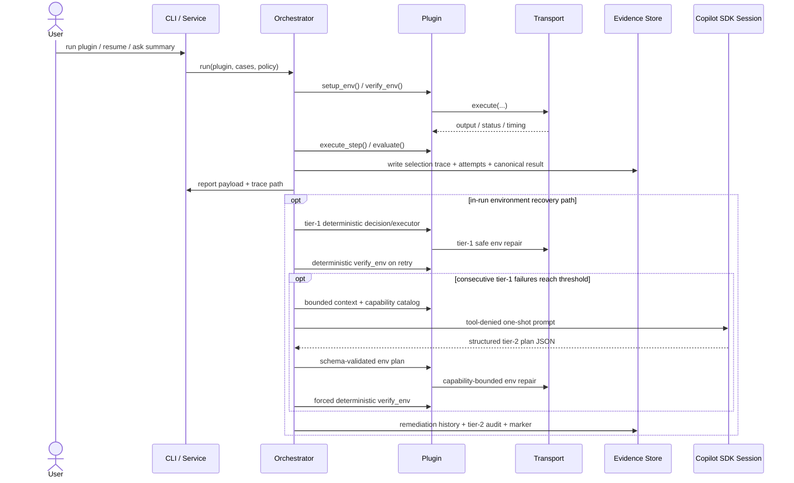

# TestPilot 系統規格書

> 狀態：第三次重構設計基線；現行對外定位與安裝方式以 `README.md` 為準
> 更新日期：2026-08-11
> 深度參考已收斂回本文件；詳細研究筆記改為 local-only，不再納入 repo。

---

## 1. 系統概述

TestPilot Core 是一套 plugin-based test automation and verification framework。公開 SDK 與 Plugin contract 不把 Core 綁定到單一產品 domain；但目前最完整的 field usage、transport integration 與複雜驗證案例仍集中在 prplOS / OpenWrt 等 embedded / real-hardware 場景。因此本文件中的 DUT / STA / Wi-Fi 範例應視為目前主要 reference path，而不是 TestPilot Core 對所有 Plugin 的 domain 限制。

第三次重構後的系統設計以兩個平面為核心：

1. **Deterministic verdict kernel**：負責正式測試生命週期、證據蒐集、retry/timeout、canonical trace/result 與報表投影；domain-specific pass/fail semantics 由 plugin 的 `evaluate()` 定義。
2. **Copilot SDK control plane**：負責 per-case session foundation、lifecycle hooks、advisory/remediation，以及 `custom_agents`、`skills`、`selective MCP` 等 extension surfaces，並提供操作員導向的自然語言 UX。

`wifi_llapi` 是形成第三次重構需求時最完整的 field path，因此本規格仍保留其案例作為設計背景。重構的重點不是把 YAML 變成 prompt，也不是把最終 verdict 交給 agent，而是保留 deterministic hot path，再把 agent orchestration 隔離到 control plane。core 現已提供 tier-1 deterministic-first、連敗後 opt-in tier-2 one-shot 的通用 recovery contract；tier-2 只能規劃 plugin-advertised environment capabilities，plugin 執行後仍由 core 強制 deterministic `verify_env`，且不允許 agent 改 testcase semantics、step 指令、pass criteria 或 canonical verdict。實際 domain capability 與 executor 必須由各 plugin 自行實作並驗證。

目前已落地的 control-plane 子集：

- per-case runner selection 與 `selection_trace`
- best-effort 的 per-case Copilot session foundation
- lifecycle hooks：`pre_case` / `post_case` / `pre_step` / `post_step` / `on_failure` / `on_retry`
- advisory collection，以及 retry 間的 tier-1 deterministic / opt-in tier-2 environment recovery

`custom_agents`、`skills`、`mcp_servers` 等欄位已存在於 request / 規格層，但目前 orchestrator 建 session 時尚未預設自動接線，因此這些部分仍屬 extension surface，而不是完整 current-state hot path。

Plugin 亦可提供 custom runner。Custom runner 是正式 extension path，但會自行承擔較多 execution pipeline 責任，也不會自動取得所有 core-owned analysis / cost-reporting path；因此本文所稱 deterministic kernel 預設指 **core-owned execution path**。

### Azure-only core cost reporting

Core resolves Azure readiness from environment variables only. A missing API key
selects deterministic/no-agent mode; a partial key/endpoint/deployment is a
non-blocking misconfigured state; setting `COPILOT_PROVIDER_TYPE` to any
non-`azure` value is also misconfigured. A complete configuration enables
Azure. Core never falls back to OAuth or another provider, and never exposes
secrets through plugin context or artifacts. CLI dispatch emits a redacted
misconfigured notice but still continues deterministic execution. Agent calls
are tool-denied and the first provider, SDK, or auth failure opens a run
circuit; malformed output does not. Per-case planning is advisory, tier-2
recovery requires explicit plugin capability and executor support, and
deterministic remediation remains plugin-owned. After all final verdicts, one
bounded run-end analysis computes observational benefit metrics. Usage is
authoritative from `assistant.usage`, deduplicated, and reported in core-owned
`artifact_dir/agent_usage` artifacts; shared analysis tokens are not allocated
to cases. Custom and skeleton runners report `unsupported_execution_path` with
zero core calls.

### 核心設計原則

- **Kernel 與 Control Plane 分層**：Copilot SDK 處理 agent/control-plane；`plugin.evaluate()` 與正式 rerun 結果仍是最終 verdict 來源。
- **Plugin 擁有 domain semantics**：Core 定義 lifecycle / SDK / trace contract；case meaning、environment action、pass criteria 與 domain-specific reporter 由 Plugin 提供。
- **YAML 是 executable spec，不是主要 prompt**：formal case semantics 應由 schema、plugin hook、transport 決定。
- **Structured evidence 是唯一真相來源**：selection trace、attempt trace、commands、outputs、canonical result 需可追蹤。
- **報告投影分離**：`xlsx` 只保留對外交付的 `Pass/Fail`；`md/json` 承載 richer diagnostic statuses、root cause、suggestion、remediation history。
- **最小化 workaround**：不再以 Codex CLI 為相容目標，不為舊 runner policy 增加額外 workaround code。

---

## 2. 目標架構圖

下圖保留目前主要 device-oriented reference path 的 transport 範例；Plugin 可透過公開 SDK 提供其他 domain 所需的 environment / execution integration。



### 平面職責表

| 平面 | 主要職責 | 不應承擔的責任 |
|---|---|---|
| **Copilot SDK control plane** | session/resume/persistence、tool policy hooks、custom agents、skills、operator UX、advisory audit、remediation planning、run summary | 正式 test semantics、正式 execution authority、最終 pass/fail 判定 |
| **Deterministic verdict kernel** | case discovery/filtering、retry-aware timeout、plugin hook execution、structured evidence、report projection、canonical verdict lifecycle | 自由對話式判讀、agent prompt orchestration、domain-specific test meaning |

---

## 3. 執行生命週期



### Deterministic hot path

正式 verdict hot path 仍固定為：

1. `setup_env()`
2. `verify_env()`
3. `execute_step()`
4. `evaluate()`
5. `teardown()`
6. canonical result + report projection

補充：

- remediation 只允許發生在 **attempt 與 attempt 之間** 的 `on_retry` 期間。
- tier-1 使用 plugin-owned deterministic allowlist。tier-2 必須明確 opt-in，且只接受 plugin capability catalog 中通過 schema/budget 的 environment actions。
- tier-2 的 SDK/provider/plan/execution/gate 任一失敗都保留 audit 並 fail-closed；LLM 或 executor 自稱成功不能取代 core-owned `verify_env`。

### Timeout / Retry 原則

- 排程粒度：`per_case`
- 預設排程：`sequential`
- 失敗策略：`retry_then_fail_and_continue`
- Timeout：`min(max_seconds, (base_seconds + steps * per_step_seconds) * retry_multiplier^(attempt-1))`
- 每次 retry 都必須保留 attempt trace，而不是只保留最後結果。

---

## 4. Copilot SDK Control Plane 規格

### 4.1 模型與 runner policy（第三次重構目標）

`wifi_llapi` 的目標 policy：

1. Priority 1: `copilot + gpt-5.4 + high`
2. Priority 2: `copilot + sonnet-4.6 + high`
3. Priority 3: `copilot + gpt-5-mini + high`

補充規則：

- 不再以 `codex CLI` 為相容目標。
- 第一優先不可用時可自動降級，但必須保留 `selection trace`。
- agent 政策與 runtime config 的對齊屬於第三次重構實作項目，不應以 workaround 方式維持舊 policy。

### 4.2 Session 策略

- session ID 應顯式命名，例如：
  - `run-{run_id}`
  - `run-{run_id}-case-{case_id}`
  - `run-{run_id}-case-{case_id}-remediate-{attempt}`
- 目前已落地的 default 行為是 **per-case create → case 結束後 best-effort delete**。
- `resume_session()` / `list_sessions()` 已有 session adapter API，但尚未成為 orchestrator 預設流程。
- tier-2 planning 使用獨立 `send_one_shot()`：目前 adapter 明確鎖定
  `github-copilot-sdk>=0.1.23,<0.2` 的 `send_and_wait()` surface，只傳入
  model/provider 等無 tool 設定並強制 deny-all permission handler；prompt 最多 64,000
  字元、timeout 最多 600 秒，timeout 先 abort，再依 SDK 回傳的實際 session ID delete。
- session state 儲存 conversational context；canonical result 仍由 kernel artifacts 承擔。

### 4.3 目前已落地的 runtime hooks

| Hook | 目的 | 限制 |
|---|---|---|
| `pre_case` | case attempt 前置檢查 / remediation preflight | 不改 formal case semantics |
| `post_case` | 收斂 advisory / remediation history / final annotations | 不覆寫 canonical evidence |
| `pre_step` | step 前攔截與前置校驗 | 不直接代替 Plugin 的正式 test execution |
| `post_step` | step 後觀測 / 附加結構化資料 | 不改正式 pass/fail 判定 |
| `on_failure` | advisory / failure snapshot / remediation proposal | 不直接改 YAML、pass criteria、或最終 verdict |
| `on_retry` | tier-1 execution / threshold 後 tier-2 one-shot | retry-only；catalog/schema/budget + forced `verify_env`，不碰 test semantics/verdict |

補充：

- Copilot SDK session-level hooks（例如 `on_session_start` / `on_pre_tool_use` / `on_post_tool_use` / `on_error_occurred`）目前仍屬 extension surface。
- `CopilotSessionRequest` 已支援這些欄位，但 orchestrator 的預設 per-case session create path 尚未自動注入。

### 4.4 Custom agents

建議角色（目前仍屬 extension surface，未自動接入 per-case session create path）：

- `operator`：操作員對話與 run/case 狀態說明
- `case-auditor`：讀 trace / evidence，輸出 root cause 與 suggestion
- `remediation-planner`：只輸出 capability-bounded structured plan JSON；one-shot session 沒有 runtime tools
- tier-1 builtin：deterministic allowlist decision；tier-2：plugin executor 在宣告 boundary 內執行，兩者都不具 verdict authority
- `run-summarizer`：彙整 run 級 md/json summary

### 4.5 Skills

建議 skill 套件（目前未作為 runtime 預設自動接線）：

- `wifi-llapi-diagnostics`
- `env-remediation-policy`
- `report-style`

### 4.6 MCP

MCP 目前仍只作為 **selective extension surface**，優先順序低於 in-process custom tools；session request 型別已保留欄位，但 runtime 預設尚未自動接線。

適合的 MCP：

- GitHub
- 知識庫 / FAQ
- lab inventory / reservation

不應成為 hot path 的：

- generic shell-on-DUT
- prompt-driven primary execution plane

---

## 5. Deterministic Kernel 規格

### 5.1 Kernel 仍保留的責任

- case discovery / case filtering
- retry-aware timeout 與 fail-and-continue
- plugin hook execution
- run-backend / transport coordination on the core-owned path
- canonical trace/result 寫入
- generic report handoff / projection contracts

Plugin-specific alignment gates（例如特定 source row、object、API mapping）應由各 Plugin 的 validation / prepare path 負責，不應被視為 Core 的通用 domain rule。

### 5.2 Canonical result

目前已落地的 canonical trace/result 形狀較接近下列 payload：

```json
{
  "run_id": "20260311T000000",
  "case_id": "D271",
  "source_row": 271,
  "execution": {},
  "selection_trace": {},
  "attempts": [],
  "final": {
    "status": "Failed",
    "evaluation_verdict": "Fail",
    "attempts_used": 2,
    "comment": "env_verify gate failed",
    "diagnostic_status": "FailEnv"
  },
  "diagnostic_status": "FailEnv",
  "failure_snapshot": {},
  "remediation_history": [],
  "tier2_audit": [],
  "agent_recovered": false
}
```

`remediation_history`、`tier2_audit`、`agent_recovered` 是固定 runtime keys；未使用時為 `[] / [] / false`。`agent_recovered` 表示 agent 曾介入，不代表 forced gate 或 final verdict 成功。run payload 另固定帶 `tier2_remediation.agent_recovered_case_ids` 與聚合 audit。`root_cause` / `suggestions` 類欄位仍較偏 advisory / summarizer layer 的衍生資訊。

### 5.3 Report projection

| 輸出 | 內容 |
|---|---|
| plugin reporter | 各 Plugin 可透過 `create_reporter()` 定義 domain-specific output |
| core trace / payload | `comment` / `diagnostic_status` / `failure_snapshot` / `remediation_history` / timing / trace references |
| core agent artifacts | tier-2 audit、agent usage、run analysis（僅支援的 core-owned path） |

既有 field plugins 可能輸出 xlsx / md / json / html；這些格式與版型不是所有 Plugin 都必須提供的通用 Core 契約。

### 5.4 不可退讓的 kernel 邊界

下列責任不得交給 conversational agent 決定：

- formal case semantics
- environment gate semantics
-正式 test execution 的 authority
- pass criteria comparison / plugin evaluation semantics
- canonical final verdict
- 任何越過 tier-1 allowlist 或 tier-2 capability/execution boundary 的動作，尤其修改 YAML、skip case、改 pass criteria 或 verdict

---

## 6. 主要資料與 artifacts

| Artifact | 目的 | 備註 |
|---|---|---|
| `agent-config.yaml` | runner/model order、execution policy、tier-1/tier-2 governance budgets | 不得存放 provider secrets |
| selection trace | 記錄模型選擇與 fallback | core-owned path 持久化 |
| attempt trace | 記錄 timeout / commands / outputs / comments | 每次 retry 都保留 |
| canonical result | 報表與後續 analysis 的共同來源 | 不可被 agent 任意覆寫 |
| plugin reports | domain-specific deliverables | 格式與內容由 Plugin reporter 定義 |
| core agent artifacts | agent usage / run analysis / tier-2 audit | optional control-plane artifacts，不構成 verdict authority |

---

## 7. 文件與目錄對照

```text
testpilot-core/
├── README.md
├── AGENTS.md
├── VERSION
├── pyproject.toml
├── docs/
│   ├── plan.md
│   ├── spec.md
│   ├── todos.md
│   └── plugin-dev-guide.md
├── src/testpilot/
│   ├── api/          # public Plugin SDK
│   ├── core/         # orchestration / lifecycle / recovery
│   ├── reporting/    # generic reporting contracts/helpers
│   ├── schema/       # generic case schema helpers
│   ├── transport/    # transport abstractions
│   └── runtime/      # run-backend abstraction
├── plugins/
│   └── _template/    # Plugin scaffold; not a domain test suite
├── examples/
│   └── sample_echo/  # runnable zero-hardware reference Plugin
└── tests/
```

Domain Plugins 可位於獨立 repository / distribution，透過 `testpilot.plugins` entry point 註冊；Core source 不應具名依賴特定 Plugin。

---

## 8. 第三次重構範圍

第三次重構分為兩條主線：

### 8.1 R4：Copilot SDK 控制平面

- session foundation
- hooks policy layer
- custom agents
- skills
- advisory audit / summary
- remediation planning
- selective MCP
- runtime policy alignment

### 8.2 R5：Deterministic kernel 補強

- plugin fallback heuristic 收斂
- session/device binding 更嚴格（device-oriented reference path）
- canonical result / report projector 完整化
- control-plane / verdict-plane 邊界測試
- orchestrator / plugin 結構瘦身與解耦

---

## 9. 已知風險與非目標

### 9.1 已知風險

- `Orchestrator` 仍是責任較重的中心點
- managed installer / field configuration 仍反映目前 maintainer 的 device-testing stack，尚未等同於通用 Plugin distribution service
- core tier-2 contract 已落地，但各實體 Plugin 的 capability/executor opt-in 仍須自行完成與驗證
- custom runner 可繞過部分 core-owned analysis path，文件與 Plugin author 需清楚區分 execution ownership
- Copilot SDK integration 仍應視為 optional control-plane capability，而不是 deterministic test path 的必要條件

### 9.2 非目標

- 不把 YAML 當作主要 execution prompt
- 不讓 agent 直接決定最終 pass/fail
- 不用 generic MCP shell 取代正式 Plugin / transport execution
- 不宣稱任意 domain 不需 Plugin integration 即可開箱執行
- 不把目前的 TestPilot Core 描述成具備集中式資源管理、registry、dashboard 等能力的完整 test platform

---

## 10. 參考文件

1. `README.md`：對外定位、目前支援方式與安裝說明
2. `docs/plugin-dev-guide.md`：Plugin SDK 開發契約
3. `docs/plan.md`：第三次重構主計畫與 phase 邊界
4. `docs/todos.md`：repo 待辦看板
5. 本文件：第三次重構設計基線與 current-state 邊界註記
6. `AGENTS.md`：專案級 agent/model/policy 規則
