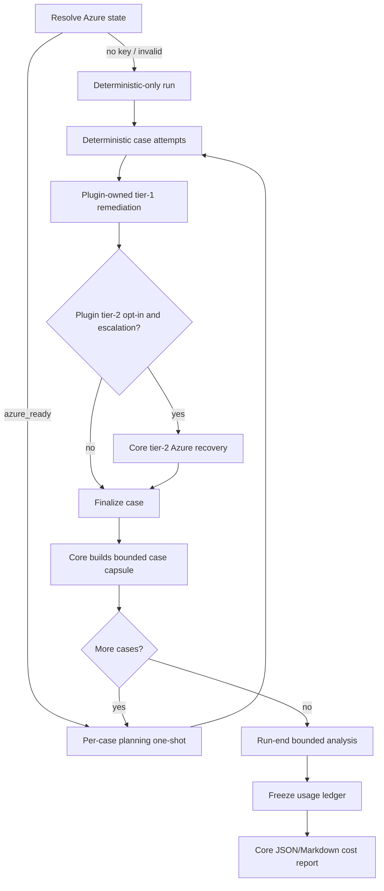

# Azure-only Agent 與 Core Cost Report Design

> 狀態：approved
> 日期：2026-07-17
> 實作範圍：`testpilot-core` only

## 1. 決策摘要

TestPilot 的 agent provider 收斂為 Azure OpenAI。Agent 不再有獨立 enable
設定：Azure credentials 完整時自動啟用；沒有 API key 時不建立任何 agent session，
直接使用 deterministic execution 與 plugin-owned tier-1 remediation。

Agent 啟用時採以下 phase：

1. 每案執行前做一次 tool-denied Azure planning；輸出只作 advisory/audit，不能改
   case semantics、執行 command 或 verdict。
2. retry-time agent recovery 只沿用既有 `PluginBase` tier-2 capability/executor
   契約；core 不具名或執行任何 plugin-specific safe action。
3. 每案結束只由 core 建立 bounded capsule，不呼叫 Azure。
4. 全部 case 完成後才進行一次 run-level analysis phase；資料過大時可拆成
   bounded batches，再以一個 reducer 收斂。
5. `testpilot-core` 產生獨立 JSON/Markdown cost report，統計 direct/shared token、
   deterministic remediation outcome 與 observational benefit。

本設計明確採用 strict core-only。`wifi_llapi` 目前未 opt in tier-2，因此其
`agent_recovery` 必須回報 `supported=false`、calls/tokens 為 0；core 不得為了讓
Azure 執行該 plugin 的 7 個 safe actions而硬編碼 Wi-Fi、serialwrap、DUT 或 STA
知識。

本版執行覆蓋固定為 core-owned run loop。覆寫`create_runner()`、自行擁有完整run
loop的plugin不經過core per-case boundary，因此不啟動本功能；這類路徑回報
`unsupported_execution_path`，不新增plugin callback或API版本。

## 2. 目標與非目標

### 2.1 目標

- Azure 是唯一允許的 model provider；不再 fallback 到 GitHub OAuth 或其他
  provider。
- `COPILOT_PROVIDER_API_KEY` 缺失時自動進入 no-agent mode，測試仍可正常執行。
- Azure ready且run-scoped circuit breaker尚未開啟時，每個 case都嘗試一個真正的
  model turn，而不是只建立空session。
- 所有 core-owned model turn 都能以 SDK usage event 精確計量並去重。
- 產生 per-case direct usage、run-level shared usage、deterministic remediation
  outcome 與 observational success metrics。
- run-end Azure analysis 只能解釋 bounded structured data；基礎比率由 core
  deterministic 計算。
- 新增內容維持 additive/fail-soft，不改 plugin reporter 或 canonical verdict。
- 目前使用core-owned run loop的plugin能取得完整功能；custom-runner/skeleton path
  維持原行為並明確回報不在coverage內。

### 2.2 非目標

- 不修改任何 plugin repo、plugin source、`agent-config.yaml`、case YAML 或 reporter。
- 不新增、搬移或泛化 `PluginBase` API，也不 bump `testpilot.api.API_VERSION`。
- 不讓 pre-case 或 run-end Azure call 執行 tools、shell、MCP、skills 或 environment
  action。
- 不讓 core 解析或執行 `serial_session_recover`、band reconnect/rebaseline、DUT
  reboot/firstboot 等 domain action。
- 不把單次 run 的 observational conversion 宣稱為 causal uplift/regression。
- 不收集 plugin 私下建立、未經 core SDK adapter 的 model call usage。

## 3. Core / Plugin Ownership

| 責任 | Core | Plugin |
|---|---|---|
| Azure credentials resolution | 唯一決策者 | 不接觸 secrets |
| agent enable/disable | 由 Azure readiness 自動決定 | 無 enable flag |
| model deployment | `COPILOT_MODEL` | runner model 不具控制權 |
| pre-case planning | tool-denied one-shot + audit | 不需 hook |
| deterministic tier-1 remediation | 編排、記錄 outcome | 分類與執行 safe actions |
| tier-2 agent recovery | prompt/schema/budget/usage | 明確 opt-in capability/executor |
| run-end analysis | bounded batch/reducer | 不需 reporter 配合 |
| cost/benefit report | 完整擁有 schema 與 artifact | 不修改 plugin report |
| test semantics/verdict | 保護與最終判定 | deterministic implementation |
| custom-runner path | 標記unsupported、不呼叫agent | 保持既有完整run ownership |

Core 只依賴 versioned `PluginBase` 契約。若 plugin 沒有覆寫
`build_tier2_remediation_context()` 與 `execute_tier2_remediation()`，agent recovery
就是 unsupported，不可退回 core-owned domain action executor。

## 4. Azure Readiness State

Core 將環境解析成單一不可含秘密的 runtime state：

```text
disabled_no_key
misconfigured
azure_ready
degraded
```

### 4.1 必要環境變數

```text
COPILOT_PROVIDER_API_KEY
COPILOT_PROVIDER_BASE_URL
COPILOT_MODEL
```

`COPILOT_MODEL` 是 Azure deployment name，不是 plugin runner priority 中的通用
model label。`COPILOT_PROVIDER_AZURE_API_VERSION` 可省略，預設 `2024-10-21`。
`COPILOT_PROVIDER_TYPE` 不再作為 enable switch；TestPilot 只會建立 Azure provider
config，任何非 Azure provider 值都不會被採用。

Runtime 仍可使用 `github-copilot-sdk` 作為 Azure provider 的 transport adapter；這不
代表保留 GitHub OAuth、GitHub-hosted model 或任何 non-Azure provider fallback。
Core package將`github-copilot-sdk>=0.1.23,<0.2`列為runtime dependency並同步lock/
offline install metadata，讓正常安裝具備actual Azure turn所需surface。若安裝損壞或
runtime import probe仍失敗，狀態轉為`degraded`，不嘗試其他provider。

狀態規則：

- API key 未設定：`disabled_no_key`，不警告、不建 session，走 deterministic mode。
- API key 已設定，但 endpoint 或 deployment 缺失：`misconfigured`，輸出不含值的
  明確 warning，仍走 deterministic mode。
- 三個必要值完整：`azure_ready`，啟用 core-owned agent calls。
- 啟用後 SDK/provider call 失敗：該 run 標記 `degraded`；case execution 與報告
  繼續，禁止 fallback 到 OAuth 或其他 provider。第一個 SDK/provider/auth/session
  failure會打開run-scoped circuit breaker，該run不再送後續agent call，避免每案重複
  timeout。單純response schema不合法只記該call失敗，不打開provider circuit breaker。

公開 trace/report 只可保存 state、deployment label、API version 與穩定 error type；
不得保存 key、endpoint、provider config、authorization header 或 raw exception text。

### 4.2 CLI 行為

- 移除 `--azure` 互動 flag 與 credential prompt。
- 啟動時自動解析 Azure state。
- 無 key 或設定不完整都不阻斷 deterministic command。
- `provider_config=None` 必須保證 runner selection、case planning、tier-2 requester
  與 run analysis 都不會建立 SDK session。
- agent model 永遠使用 Azure deployment；plugin `runners[*].model` 不再覆寫它。
- Existing selected runner仍作為execution identity傳入plugin hooks；Azure readiness、
  deployment與usage另存於core-owned agent runtime state，兩者不得混為同一欄位。

## 5. Agent Phase Data Flow



### 5.1 Per-case planning

現有 ordinary path 只建立/刪除 SDK session，沒有 model turn。本設計改成真正的
tool-denied `send_one_shot()`：

- input 只包含 bounded/redacted case identity、band、step/criteria 摘要、execution
  policy 與非敏感 run metadata；
- output 是固定 JSON，包含風險摘要、注意點與預期觀察項目；
- output 只寫入 case trace，不能改 runner、retry、timeout、case、step、criteria、
  command、environment 或 verdict；
- malformed/timeout/provider failure 一律 fail-open，deterministic case 照常執行；
- usage purpose 固定為 `case_planning`，精確綁定單一 case。
- planning request直接取用Azure runtime deployment；不得改寫或借用plugin-visible
  `_agent_runner` identity。

每案planning status固定為`completed`、`failed`、`skipped_no_agent`或
`skipped_circuit_breaker`。Breaker打開後的case其calls/tokens為0，不能偽裝成已呼叫；
report同時保存`initial_agent_state=azure_ready`與`final_agent_state=degraded`。

由於 planning 是 read-only advisory，其成功效益不應以 verdict uplift 表示；報表只
呈現 call success、token cost 與 advisory availability。

### 5.2 Deterministic remediation

既有 plugin `build_remediation_decision()` / `execute_remediation()` 路徑不變。
其 model token 永遠為 0，但 cost report 仍記錄：

- decision/action count；
- applied/failed；
- plugin `verify_after` 與 core next-attempt verification；
- 後續 final verdict；
- 可取得時的 duration。

### 5.3 Agent recovery

只沿用既有 tier-2 contract：plugin 廣告 bounded capability/schema，core 呼叫
tool-denied Azure planner並驗證 plan，plugin 執行，core 強制 deterministic
`verify_env`。Usage purpose 固定為 `agent_recovery`。

若 plugin 未 opt in：

```json
{
  "supported": false,
  "calls": 0,
  "input_tokens": 0,
  "output_tokens": 0,
  "reason": "plugin_capability_unavailable"
}
```

`supported=true` 必須同時滿足：effective tier-2 safety policy已opt in，且plugin覆寫
兩個tier-2 context/executor方法。任一條件不成立時，core不得建立agent recovery
requester或把unsupported當成case failure。

Core 不得把 plugin tier-1 `allowed_actions` 當成 tier-2 capability catalog，也不得把
Azure output直接傳給 `execute_remediation()` 來繞過 schema/executor boundary。

### 5.4 Run-end analysis

每個 case 完成後，core 只建立 capsule，不呼叫 model。Capsule包含：

- case id 與 final/initial verdict；
- attempts count 與 bounded failure classification；
- deterministic remediation action/outcome；
- agent recovery plan/gate/final outcome；
- direct token usage與 case duration；
- 不含 raw log、prompt、model response、endpoint、key 或任意 transport handle。

所有 case 完成後才執行一個 analysis phase：

- payload 加固定 prompt後以 48,000 characters 為 packing target，保留既有
  64,000-character one-shot hard limit 的安全空間；
- 能容納時只送一個 request；超出時按完整 capsule boundary拆 batch；
- 多 batch 時，各 batch 回固定 JSON summary，再以一個 bounded reducer收斂；
- reducer 只讀 batch summaries，不重新帶入 case evidence；
- analysis/reducer 自身 usage 都歸 `shared`，不可遞迴觸發第二輪 cost analysis；
- 任一 analysis failure 只將狀態標為 unavailable/failed，不改任何 case verdict，
  也不使整個 run 失敗。

## 6. Usage Ledger

Core 新增 run-scoped append-only invocation/usage ledger。每次準備送出SDK call前先寫
invocation lifecycle record；SDK `assistant.usage`是token authoritative source；
`session.usage_info`只作reconciliation，不與event usage重複相加。

Invocation record固定包含`invocation_id`、case/purpose、`started_at`、status與穩定
error type。`calls`計算已進入`started`的invocation；`skipped_no_agent`與
`skipped_circuit_breaker`不算call。即使provider在usage event前失敗，call count仍為1、
tokens標示unavailable，而不是把失敗呼叫漏掉。

### 6.1 去重與計量

每筆 usage 以 `(session_id, api_call_id)` 去重，保存：

```json
{
  "session_id": "run-...",
  "api_call_id": "...",
  "case_id": "D001",
  "purpose": "case_planning",
  "model": "azure-deployment",
  "input_tokens": 0,
  "output_tokens": 0,
  "cache_read_tokens": 0,
  "cache_write_tokens": 0,
  "provider_cost_units": null,
  "duration_seconds": null
}
```

`api_call_id`缺失時不得猜測或以prompt字數替代：有SDK event id時以
`(session_id, event_id)`作fallback並標示`dedupe_basis=event_id`；兩者都缺失時只將
該turn標記`usage_status=unavailable`，不加入精確token total。

允許的 purpose：

```text
case_planning
agent_recovery
run_analysis_batch
run_analysis_reducer
```

`model_tokens = input_tokens + output_tokens`。Cache read/write 分欄呈現，不再加進
model token total。SDK `cost` 的幣別/單位未由現有 schema 保證，因此保存為
`provider_cost_units`，不可自行標成 USD。

Ledger 不保存 prompt、response、quota snapshot、key、endpoint 或 provider config。
不具 usage event 的 successful model turn標記 `usage_status=unavailable`，不可用字元數
冒充 token。

### 6.2 Coverage

報表固定標示：

```text
coverage: core_sdk_calls_only
execution_path: core_run_loop
```

若 plugin 自行在 core adapter 外呼叫 model，usage 不在本報表範圍。這次不新增
plugin-to-core usage callback。

## 7. Cost Report Schema

Core-owned artifacts 放在既有 run artifact下：

```text
<artifact_dir>/agent_usage/events.jsonl
<artifact_dir>/agent_usage/cost-report.json
<artifact_dir>/agent_usage/cost-report.md
<artifact_dir>/agent_usage/run-analysis.json
<artifact_dir>/agent_usage/run-analysis.md
```

### 7.1 Per-case direct usage

每個 case 固定輸出：

```json
{
  "case_id": "D001",
  "agent": {
    "purpose": "case_planning",
    "status": "completed",
    "calls": 1,
    "input_tokens": 0,
    "output_tokens": 0,
    "total_tokens": 0
  },
  "deterministic_remediation": {
    "calls": 0,
    "tokens": 0,
    "actions": 0,
    "observed_resolution": false
  },
  "agent_recovery": {
    "supported": false,
    "calls": 0,
    "input_tokens": 0,
    "output_tokens": 0,
    "total_tokens": 0,
    "observed_resolution": false
  },
  "direct_total_tokens": 0
}
```

`direct_total_tokens` 是可精確歸案的 usage。Run-end batch屬 shared，不默認攤入
per-case total，以免製造假精度。

### 7.2 Shared 與 run total

Run summary另列：

```json
{
  "shared": {
    "run_analysis_tokens": 0,
    "batch_calls": 0,
    "reducer_calls": 0
  },
  "total": {
    "direct_tokens": 0,
    "shared_tokens": 0,
    "all_core_model_tokens": 0
  }
}
```

若未來需要成本分攤，必須新增明確 `estimated` 欄位與 allocation method；本版不做
per-case shared allocation。

### 7.3 Core payload integration

Run-end analysis與cost artifact在`RunResult`建好後、plugin reporter呼叫前完成並
freeze；plugin不會收到或依賴這些資料。Plugin `build_reports(run_result)`契約維持
不變。Reporter回傳payload後，core只以additive key附加：

```json
{
  "core_cost_report": {
    "status": "complete",
    "json_path": ".../cost-report.json",
    "markdown_path": ".../cost-report.md",
    "analysis_status": "complete"
  }
}
```

Plugin 的 XLSX/MD/JSON reporter 不需讀取或嵌入此資料。

## 8. 輔助效益與成功變化

基本比率由 core 直接從 `RetryResult`、attempts、tier-1 trace 與 tier-2 audit計算；
Azure 不負責算術或決定 verdict。

本版輸出：

```text
initial_pass_rate
final_pass_rate
overall_observed_delta_percentage_points
deterministic_env_gate_conversion_rate
deterministic_observed_resolution_rate
agent_recovery_plan_acceptance_rate
agent_recovery_env_gate_conversion_rate
agent_recovery_observed_resolution_rate
post_gate_case_failure_rate
```

定義：

```text
overall_observed_delta_pp = final_pass_rate - initial_pass_rate

deterministic_observed_resolution =
  initial_fail AND deterministic remediation existed
  AND no tier-2 intervention AND final_pass

agent_recovery_observed_resolution =
  initial_fail AND tier-2 agent invoked
  AND deterministic verify gate passed AND final_pass
```

所有比率固定帶：

```json
{
  "evidence_level": "observational",
  "causal_uplift": "unavailable"
}
```

Tier-2 只處理 tier-1 已失敗的較難案例，存在 selection bias。`gate pass` 後 final fail
只能命名為 `post_gate_case_failure`，不可稱為 agent regression。真正 causal uplift 或
decline需要 paired/randomized assistance-off run，或可信的 matched historical baseline；
不在本版範圍。

## 9. Fail-soft 與安全規則

- 無 key、設定不完整、SDK unavailable、provider failure、timeout、malformed output
  或 analysis failure均不得改變 deterministic verdict。
- Azure call 一律 deny tools；不提供 working directory、runtime tools、MCP、skills
  或 plugin transport。
- Pre-case output與 run analysis都是 advisory，不可寫回 case或 execution policy。
- Agent recovery仍受既有 capability schema、action/invocation/attempt/timeout budget、
  case semantics guard 與 deterministic `verify_env` gate。
- 所有 artifact先 redaction與size bound；secret-like keys一律拒絕或遮罩。
- 沒有 Azure時仍產生 cost report，內容顯示 agent disabled、model token為0，並保留
  deterministic remediation/benefit統計。

## 10. 預計 Core 修改面

### 10.1 現有模組

- `core/azure_auth.py`：Azure-only state resolver、deployment與redacted status。
- `cli.py`：移除互動 flag/OAuth fallback，自動建立 Azure state。
- `cli_support.py`：傳遞 runtime Azure state與顯示非敏感 notice。
- `core/copilot_session.py`：actual one-shot、usage event subscription與purpose binding。
- `core/orchestrator.py`：run-scoped ledger、pre-case/tier-2/run-analysis requester gate。
- `core/run_loop.py`：case capsule、run-end analyzer、cost artifact與additive payload。
- `pyproject.toml`、lock/offline install metadata：納入並固定SDK runtime dependency。

### 10.2 新模組

- `core/usage_ledger.py`：invocation lifecycle、usage event ingestion、dedupe、
  case/purpose aggregation與freeze。
- `core/case_planning.py`：bounded pre-case prompt、固定JSON parser與trace projection。
- `core/run_analysis.py`：capsule、packing、fixed JSON parser與bounded reducer。
- `core/assistance_metrics.py`：從run records純函式計算observational rates。
- `reporting/usage_reporter.py`：core cost/benefit JSON與Markdown projection。

### 10.3 文件與測試

- 同步 `README.md`、`docs/spec.md`、`docs/plan.md`、CLI help與
  `CHANGELOG.md [Unreleased]`。
- 新增 usage ledger/reporter/run analysis單元測試。
- 擴充 Azure auth、CLI、runner selector、session adapter、orchestrator、tier-2與
  run-loop integration tests。
- 新增custom-runner/skeleton bypass與wheel install smoke測試。
- 測試一律使用 fake SDK/plugin，不連 Azure、不操作 DUT/STA/serialwrap。

## 11. Compatibility

- 不修改 `PluginBase`、`PreparedRun`、plugin reporter或`build_reports()` signature。
- 不修改 `testpilot.api.API_VERSION`。
- 不新增`RunResult`欄位；run analysis直接讀取core持有的`RunResult.cases`，report
  metadata只在plugin reporter回傳後附加至payload。
- Existing plugin config中的 execution/retry/hooks/deterministic remediation仍有效。
  Existing runner selection與plugin-visible`_agent_runner`也維持不變；
  `runners[*].enabled/model/priority`只是不再控制core Azure enable/deployment。
- `remediation.enabled`仍是 deterministic remediation policy；tier-2 capability opt-in
  仍是 plugin safety contract。兩者都不是 Azure provider 的 enable switch。
- Existing case/run JSON只新增 keys，不刪除既有 keys。
- Runtime cost artifact雖位於 plugin run artifact directory，檔案由 core產生且為
  gitignored output，不是 plugin source change。
- 移除`--azure`是本需求明確要求的 CLI compatibility change；README、help與測試必須
  同步，不能留下互動認證或OAuth fallback的陳舊描述。

## 12. 驗收條件

1. 無 Azure API key時不建立 SDK session、不嘗試 OAuth，所有 deterministic tests
   正常執行，cost report token為0。
2. API key存在但 endpoint/deployment缺失時明確標記 misconfigured，不洩漏值，並
   繼續 deterministic run。
3. Azure ready且breaker未開啟前，每案恰有一次actual planning attempt並使用
   deployment name；usage event精確綁定case。Breaker開啟後的case明確回報
   `skipped_circuit_breaker`、calls/tokens為0，run保存initial/final agent state。
4. Plugin未支援tier-2時不呼叫agent recovery，報表為unsupported/0；deterministic
   remediation仍正常執行。
5. Run-end analysis在所有case final verdict後開始；能單batch則一次完成，超限才
   batch+reducer。
6. Assistant usage依`(session_id, api_call_id)`去重；cache與provider cost欄位不被
   重複或錯誤命名。
7. JSON/Markdown report包含per-case direct、shared、run total、observational benefit、
   coverage與analysis status。
8. 任一 agent/provider/report failure不改verdict、不使run失敗、不fallback到其他
   provider。
9. Tests證明core沒有具名或執行任何wifi/serialwrap/DUT/STA action。
10. Custom-runner/skeleton path不送agent call、不更動plugin runner contract，並回報
    `unsupported_execution_path`；core-loop path回報`execution_path=core_run_loop`。
11. Wheel/managed install smoke證明SDK dependency可import且Azure-ready path具備
    `send_and_wait`/event subscription所需surface。
12. `uv run pytest -q`與`python3 -m policy_check --repo .`全綠後才可宣告完成。
