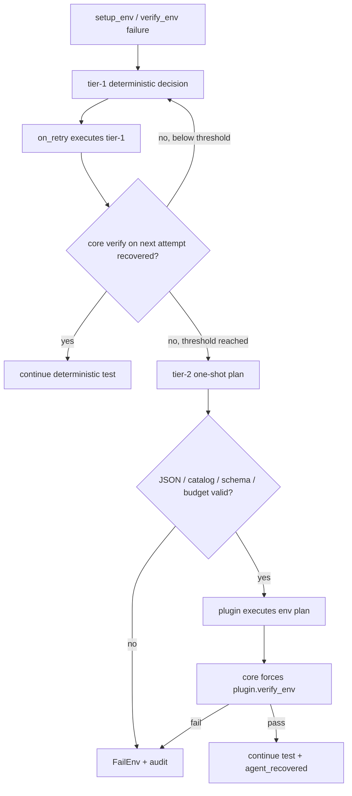

# Tier-2 Environment Recovery Design

> 狀態：implemented core framework
> 日期：2026-07-17
> 對應：`hamanpaul/testpilot-core#4`
> plugin 執行面：由各 plugin 明確 opt-in；`wifi_llapi` 追蹤於其 #112

## 1. 目標與邊界

TestPilot 的正式 test semantics、transport execution、pass criteria 與 verdict
仍由 deterministic kernel 掌握。tier-2 只在常規 tier-1 修復連續失敗後，讓
one-shot LLM 產生一份 bounded environment-recovery plan，再由 plugin-owned
executor 執行。LLM 本身沒有 runtime tools，也不能直接執行指令。

「較大 env authority」的精確意義是：tier-2 可從 plugin 明確宣告的 capability
catalog 選取 environment action；它不代表 unrestricted shell，也不越過
retry-only phase、schema、budget、execution boundary、audit 或 deterministic
`verify_env` gate。

不在 core #4 範圍內：

- domain-specific failure classification 與 tier-1 規則；
- plugin 的實際修復 transport、command 與 readiness 定義；
- agent 修改 YAML、step、pass criteria、evaluation 或 verdict；
- 自動把成功修法寫回 deterministic 規則。

## 2. Core / Plugin Ownership

| 責任 | Core | Plugin |
|---|---|---|
| escalation state / retry budget | 強制 | 不可覆寫 |
| prompt scaffold / response parser | domain-agnostic 實作 | 提供 bounded context |
| capability schema / action budget | 驗證 | 宣告 catalog |
| one-shot provider session | 建立 tool-denied session | 不接觸 |
| environment side effects | 不認得 domain command | 在宣告 boundary 內執行 |
| readiness gate | 強制呼叫 | 實作 deterministic `verify_env` |
| test semantics / verdict | 保護並最終判定 | 不可由 remediation 改寫 |
| audit / marker | 固定 artifact schema | 提供已去敏素材 |

Core 只依賴 `PluginBase` 契約，不 import 或具名任何實體 plugin。

## 3. State Machine



規則：

1. `on_failure` 只建立 deterministic tier-1 decision；不呼叫 LLM。
2. tier-1 execution 只發生在下一個 `on_retry` gap。
3. explicit tier-1 failure 立即計數；若 tier-1 自稱成功，下一次真實 core
   `verify_env` failure 仍會計數，避免 optimistic self-report 壓掉 escalation。
4. 預設連續兩次 tier-1 failure 才能升 tier-2；非 environment/session failure
   會清除該 streak。
5. tier-2 最多依 policy 呼叫指定次數。無合法 requester、plan、executor 或 gate
   結果時一律 fail-closed。
6. tier-2 gate 通過後才進入正常 attempt；LLM 或 plugin executor 的 `success=true`
   不能取代 gate。

## 4. Configuration

Tier-2 預設 opt-out。plugin 的 `agent-config.yaml` 可宣告：

```yaml
hooks:
  enabled_hooks: [pre_case, on_failure, on_retry, post_case]
  fail_open: false

remediation:
  enabled: true
  allowed_actions:              # tier-1 deterministic only
    - plugin_tier1_action
  max_actions_per_attempt: 3
  tier2:
    enabled: false              # plugin must opt in explicitly
    escalate_after_tier1_failures: 2
    max_invocations_per_case: 1
    max_actions: 3
    timeout_seconds: 60
    max_total_attempts: 4
```

`max_total_attempts` 是 case 的硬 budget：它可以把既有 retry 值提高到可達
escalation 的大小，也會壓低過高值。為了讓 optimistic tier-1 outcome 仍有下一個
retry gap 可升級，必須滿足：

```text
max_total_attempts >= escalate_after_tier1_failures + 2
```

不合法配置在 coordinator 初始化時直接拒絕。

## 5. Prompt and Plan Contract

Plugin 透過 `build_tier2_remediation_context()` 提供：

```json
{
  "diagnosis": "bounded diagnosis",
  "log_excerpt": ["bounded log line"],
  "capabilities": [
    {
      "executor_key": "plugin_env_repair",
      "description": "environment-only operation",
      "execution_boundary": "plugin-owned isolated transport",
      "params_schema": {
        "target": {"type": "string", "max_length": 100}
      }
    }
  ],
  "verify_env_definition": "deterministic readiness conditions",
  "metadata": {}
}
```

Core 將 failure snapshot、tier-1 failure count 與上述 context 組成 prompt。prompt
明示禁止修改 test case、step、criteria、evaluation 與 verdict，要求只輸出單一 JSON：

```json
{
  "summary": "repair summary",
  "rationale": "why this plan matches the evidence",
  "actions": [
    {
      "executor_key": "plugin_env_repair",
      "params": {"target": "example"}
    }
  ]
}
```

Parser 只接受 plain JSON 或單一 fenced JSON object；拒絕 unknown executor、額外/
缺少參數、型別/enum/長度不符、非有限數值、超出 action budget、敏感 material，
以及任何 test-control field。`schema_validated=true` 只代表結構合法，不表示 core
理解 domain side effect；plugin 必須在 `execution_boundary` 內再次強制限制。

## 6. One-Shot Provider Boundary

Orchestrator 在每案 runner 已選定後建立 remediation requester，capture 該案的
`run_id`、`case_id`、model/effort、provider 與 timeout。session ID 為：

```text
run-<run>-case-<case>-remediate-<invocation>
```

`CopilotSessionManager.send_one_shot()` 目標為
`github-copilot-sdk>=0.1.23,<0.2`：

- request config 採 allowlist，只保留 session/model/provider 等必要欄位；
- permission handler deny-all；不暴露 tools、MCP、hooks、skills、working directory
  或 runtime config；
- prompt 上限 64,000 chars，timeout 上限 600 seconds；
- timeout 先 abort in-flight work，再依 SDK 回傳的 actual session ID delete；
- SDK/provider failure 只 warning 一次、標記 `agent_session_degraded`，捨棄 raw
  exception text 後只向 coordinator 丟出 stable error type；
  invalid response 會先標記 degraded，再把 raw response 交給 coordinator 留 audit、
  authoritative parse 並 fail-closed。

Provider config 只在 memory 中傳給 SDK。公開 `selection_trace.session_plan` 採欄位
allowlist，不含 `provider_config`；exception/status 也先 redaction，避免 Azure API key
進入 log 或 `agent_trace/*.json`。

## 7. Semantics Guard and Verify Gate

Core 傳給 tier-1 decision hook、tier-1 executor、tier-2 context hook、tier-2 executor
與 tier-2 verify hook 的 case 都是 deep copy。每個邊界前後比較所有非 runtime
scratch fields；若 plugin 嘗試修改 steps、pass criteria 或其他 public case semantics，
該操作會被拒絕並 fail-closed。

合法 tier-2 plan 執行後，core 一律呼叫：

```python
plugin.verify_env(case_copy, topology=core_topology)
```

只有此結果為 true 且 case semantics 未變，gate 才算通過。

## 8. Artifact and Observability Contract

每個 case trace 固定包含，未使用時為 `[] / [] / false`：

```json
{
  "remediation_history": [],
  "tier2_audit": [],
  "agent_recovered": false
}
```

每個 tier-2 audit 保存：case/attempt、trigger count、bounded/redacted context、prompt、
raw response、validated plan、plugin execution result、deterministic verify result、status
與 error。run payload 固定包含：

```json
{
  "tier2_remediation": {
    "agent_recovered_case_ids": [],
    "audit": []
  }
}
```

`agent_recovered=true` 表示 agent 已介入，包含 provider/plan/execution/gate failure；
它不表示修復成功。成功與否必須查看 `tier2_audit[].verify_gate.passed` 與 final
deterministic verdict。即使最後 Pass，也不可當作無介入的 clean pass。

Coordinator 以 INFO 記錄 eligible category、tier-1/tier-2 decision source、action 與
verify gate；log 不記 raw provider secrets 或任意未去敏 exception。

## 9. Human-in-the-Loop Feedback

成功 audit 是反哺素材，不是自動 policy update。維護者人工審查 diagnosis、plan、
execution boundary 與 verify evidence 後，才能在 plugin repo 新增 deterministic
`reason_code -> tier-1 action` 或 executor，並以正常 review/test 流程落地。Core 不會
從 audit 自動修改 plugin、YAML 或 allowlist。

## 10. Verification

Core 以 hermetic fake plugin/session manager 驗證完整鏈：

```text
tier-1 #1 fail -> tier-1 #2 fail -> one-shot JSON -> plugin executor
-> forced verify_env -> normal deterministic attempt
```

測試另鎖定 gate failure、invalid JSON、unknown/out-of-schema action、attempt/action/
invocation budget、test-semantics mutation、SDK timeout/cleanup、secret redaction、固定
case/run artifact 欄位，以及 core 不得具名任何實體 plugin。所有測試不連線裝置，
也不操作 serialwrap runtime。
